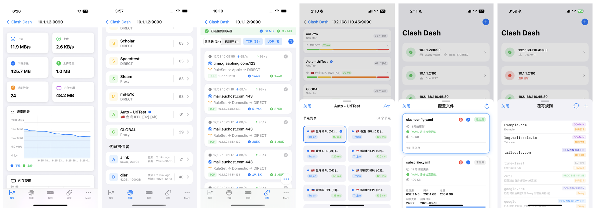

# Clash Dash

Clash Dash 是一款原生 SwiftUI 开发的 OpenClash/MihomoTProxy 管理工具。

## 预览

## 主要功能

- 便捷管理多个 Clash 服务（OpenClash、Sing-Box、MihomoTProxy）
- 切换、编辑 Clash 配置文件
- 编辑 Clash 订阅信息
- 快速启动进入指定服务器
- 支持原版和 Meta 版 Clash 内核
- 支持 sing-box 控制面板
- 实时监控服务器状态和性能
- 可视化流量统计和速率图表
- 灵活配置代理规则和策略组
- 一键测试全部节点延迟
- 本地网络访问

## 使用帮助

请查阅：[Clash 控制器的使用说明](HOWTOUSE.md)

## 故障排除

如果你在使用过程中遇到问题，请查看我们的 [故障排除指南](TROUBLESHOOTING.md)。常见问题包括：

- OpenWRT 认证相关问题
- OpenClash/MihomoTProxy 插件问题

## 隐私声明

Clash Dash **不会收集任何用户数据**。具体来说：

- 不收集任何个人信息
- 不追踪用户行为
- 不上传任何使用数据
- 所有数据都存储在用户设备本地
- 没有内置分析或跟踪代码
- 不与任何第三方共享数据

## 技术特点

- 原生 SwiftUI 开发
- 完美支持 iOS 系统
- 完全开源，代码透明

## 交流反馈

如果您在使用过程中遇到任何问题，欢迎加入 Telegram 群组进行交流：
[Clash Dash iOS 交流群](https://t.me/Clash_Dash_iOS)
